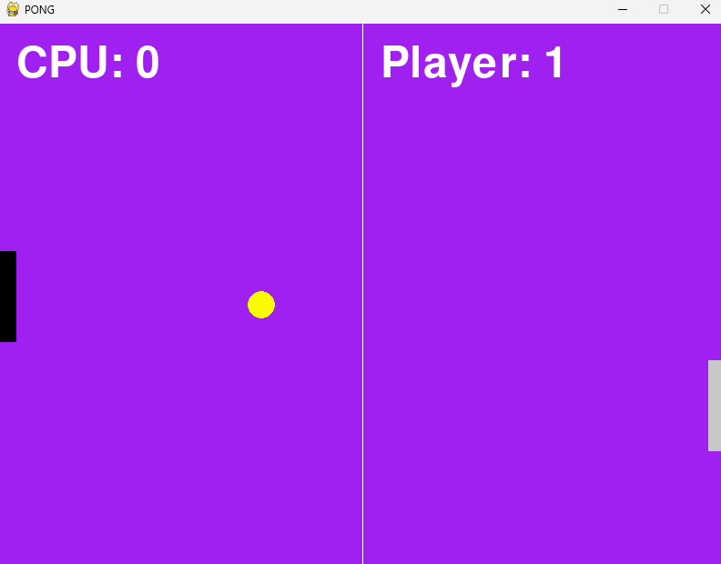
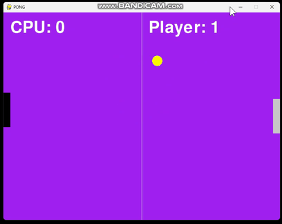

# Pygame Pong

<p align="center">
  
</p>

<p align="center">
  Projeto didático de um Pong em Pygame com jogabilidade simples, pontuação, IA básica e áudio gerado em tempo real.
</p>

<p align="center">
  
  
  
  
</p>

**Autor:** Joabe Nonato

---

## Sumário

- [Sobre o projeto](#sobre-o-projeto)
- [Demonstração](#demonstração)
- [Como jogar](#como-jogar)
- [Requisitos](#requisitos)
- [Como executar](#como-executar)
- [Gerar executável](#gerar-executável)
- [Estrutura do projeto](#estrutura-do-projeto)
- [Arquitetura](#arquitetura)
- [Sistema de áudio](#sistema-de-áudio)
- [Aprendizados](#aprendizados)
- [Próximos passos](#próximos-passos)

## Sobre o projeto

Este repositório foi montado como material de estudo para quem está aprendendo Pygame.

A proposta é mostrar, de forma pequena e organizada, como um jogo funciona por dentro:

- janela e loop principal
- controle das raquetes
- movimento da bola
- colisão entre objetos
- placar e condição de vitória
- efeitos sonoros e música simples

## Demonstração

O GIF abaixo mostra o jogo em movimento e deixa o repositório mais vivo quando ele for aberto no GitHub.

<p align="center">
  
</p>

A imagem de capa continua disponível no topo do README como destaque visual do projeto.

## Como jogar

- `Seta para cima` e `Seta para baixo`: mover a raquete do jogador
- `Enter`: iniciar a partida ou reiniciar após vitória
- `Esc`: sair do jogo

## Requisitos

- Python 3
- `pygame`
- `numpy`

Instalação:

```bash
pip install pygame numpy
```

O projeto também inclui um `requirements.txt` para facilitar a instalação das dependências em uma única vez:

```bash
pip install -r requirements.txt
```

## Como executar

Na raiz do projeto, rode:

```bash
python main.py
```

## Gerar executável

Se você quiser criar uma versão para download no Windows, use `PyInstaller`.

Instalação da ferramenta:

```bash
pip install pyinstaller
```

Build do executável:

```powershell
.\build_release.ps1
```

Ou, se preferir rodar o comando diretamente:

```bash
python -m PyInstaller --noconfirm --clean --onefile --windowed --name pygame_pong --distpath release --workpath build --specpath build main.py
```

O arquivo final ficará em `release/`.

## Estrutura do projeto

```text
pygame_pong/
├── README.md
├── main.py
├── assets/
│   └── image/
│       └── game_pong.png
│   └── video/
│       └── pong.gif
├── audio/
│   ├── efeitos.py
│   ├── gerar_audio.py
│   ├── musicas.py
│   └── partituras.py
├── entities/
│   ├── base_ball.py
│   ├── base_CPU.py
│   ├── base_player.py
│   └── base_score.py
└── system/
    ├── helpers.py
    └── settings.py
```

## Arquitetura

### `main.py`

É o ponto de entrada do jogo. Ele:

- inicializa o Pygame
- inicializa o mixer de áudio
- cria a janela
- controla o loop principal
- trata eventos do teclado
- atualiza a lógica do jogo
- desenha os elementos na tela

Também é aqui que o jogo dispara os sons de menu, partida, colisão, pontuação e vitória.

### `entities/base_ball.py`

Responsável pela bola do jogo.

Ela:

- cria o retângulo da bola
- movimenta a bola horizontal e verticalmente
- rebate no topo e no rodapé
- aumenta a dificuldade aos poucos

### `entities/base_player.py`

Representa a raquete do jogador.

Ela:

- lê as setas do teclado
- move a raquete para cima e para baixo
- impede que a raquete saia da tela

### `entities/base_CPU.py`

Representa o adversário controlado pelo computador.

Ela:

- segue a posição vertical da bola
- mantém a raquete dentro da tela

Essa IA é propositalmente simples, o que a torna ótima para estudo.

### `entities/base_score.py`

Responsável pela pontuação e pela condição de vitória.

Ela:

- conta os pontos do jogador
- conta os pontos da CPU
- define quando alguém vence

### `system/helpers.py`

Contém funções auxiliares de renderização, como `escrever()`, usada para desenhar textos centralizados.

### `system/settings.py`

Centraliza as configurações do jogo:

- largura e altura da janela
- FPS
- pontuação máxima
- cores

### `audio/gerar_audio.py`

Gera ondas sonoras com `numpy`.

Esse arquivo converte frequência e duração em um array de áudio que depois vira som no `pygame.mixer`.

### `audio/partituras.py`

Define as notas e a sequência usada pela trilha do jogo.

### `audio/musicas.py`

Monta a música principal a partir da partitura.

### `audio/efeitos.py`

Cria os efeitos sonoros curtos usados durante a partida, como:

- batida da bola
- pontuação
- menu
- vitória

## Sistema de áudio

O áudio foi pensado para ser didático e simples, sem depender de um monte de arquivos prontos.

### Fluxo do áudio

1. O jogo inicializa `pg.mixer` com frequência de `44100 Hz`.
2. As notas ficam definidas em `audio/partituras.py`.
3. `audio/gerar_audio.py` transforma essas notas em ondas senoidais.
4. `audio/musicas.py` monta a música principal.
5. `audio/efeitos.py` prepara os efeitos sonoros curtos.

### Quando os sons tocam

- ao abrir o jogo, toca uma música de menu
- ao apertar `Enter`, a partida começa e a música principal entra em loop
- ao colidir com uma raquete, toca um som de batida
- ao marcar ponto, toca um som curto de pontuação
- ao vencer, toca uma música de vitória

## Aprendizados

Se você está estudando Pygame, este projeto é um bom exercício porque reúne conceitos essenciais:

- `Rect` para representar objetos
- `draw` para desenhar formas geométricas
- `event.get()` para capturar teclas
- `colliderect()` para colisão
- `Clock` para controlar FPS
- `mixer` para áudio
- `numpy` para geração de ondas sonoras

## Próximos passos

### Roadmap

- [x] criar o jogo base de Pong
- [x] adicionar sistema de pontuação
- [x] adicionar IA simples para a CPU
- [x] adicionar sons e música
- [x] incluir imagem de destaque no README
- [x] publicar o projeto no GitHub
- [x] adicionar `requirements.txt`
- [ ] adicionar menu inicial
- [ ] melhorar a IA da CPU
- [ ] aumentar a dificuldade com o tempo
- [ ] adicionar tela de pausa
- [ ] registrar placares
- [ ] incluir gifs de gameplay no README
- [ ] separar melhor os assets de áudio

## Licença

Use livremente para estudo e adaptação. Se publicar uma versão modificada, vale citar a origem do projeto.
